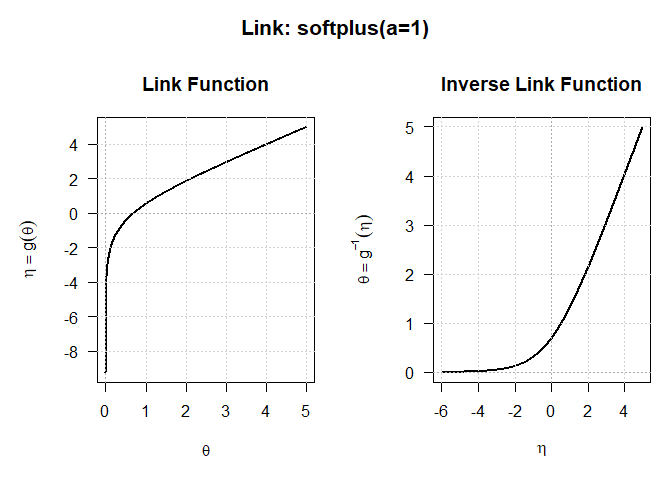

<!-- README.md is generated from README.Rmd. Please edit that file, then
     regenerate with devtools::build_readme(). Do not use knitr::knit(): it
     processes the code but leaves this YAML header in the output as literal
     text, which GitHub and pkgdown both render verbatim. -->

<!-- badges: start -->

[](https://github.com/statmodels7/linkfunctions7/actions/workflows/R-CMD-check.yaml)
[](https://app.codecov.io/gh/statmodels7/linkfunctions7)
[](https://lifecycle.r-lib.org/articles/stages.html#experimental)
<!-- badges: end -->

# linkfunctions7 

In most R modelling packages a link function has no standing of its own.
It is a string you pass to a fitting routine, unpacked internally into a
couple of closures that nothing outside can reach: you cannot hand one
to another package, ask it for its second derivative, or add your own
without editing somebody else’s source.

`{linkfunctions7}` makes a link an object. Fourteen of them, each
carrying **exact analytical derivatives up to fourth order in both
directions** — forward and inverse — and a diagnostic that verifies
those derivatives against numerical ones. Written once, usable by
anything.

It is part of [statmodels7](https://statmodels7.github.io), an S7 stack
for statistical modelling, and is what
[distributions7](https://statmodels7.github.io/distributions7) uses to
move between a constrained parameter and the unconstrained scale a
fitting routine works on. The mathematics behind every formula —
including the derivation of all the derivatives to fourth order — is
worked out in full in [the statmodels7
book](https://statmodels7.github.io/book/).

## Installation

``` r
# install.packages("pak")
pak::pak("statmodels7/linkfunctions7")
```

## A link is an object

Each link is created by a constructor and knows its own name, domain and
parameters. The two directions — the forward link $\eta = g(\theta)$ and
the inverse $\theta = g^{-1}(\eta)$ — are generics that dispatch on it,
as are all eight derivatives.

The softplus link is a good place to start, because it shows why having
more than one positivity link matters. Like the log it keeps $\theta$
positive, but where the log implies an exponential relationship
everywhere, the softplus bends smoothly into a straight line as $\eta$
grows, so a large linear predictor is not amplified into an enormous
parameter:

``` r
softplus_link(a = 1)
#> S7 Link Object: softplus(a=1)
#>   - Parameter domain (theta): (0, Inf)
#>   - Link parameters: a = 1
plot(softplus_link(a = 1))
```



A parameter confined to an interval gets `bounded_link()`, which maps
the interval onto the whole real line — give it a lower bound, an upper
bound, or both. Whatever the link, the derivatives are exact formulas
rather than finite differences, and they go to fourth order in both
directions:

``` r
link <- bounded_link(lwr = -3, upr = 2)
theta <- linkinv(link, seq(-3, 3, length.out = 5))

theta                    # stays inside (-3, 2) whatever eta is
#> [1] -2.762871 -2.087872 -0.500000  1.087872  1.762871
dlinkfun(link, theta)    # g'(theta), exactly
#> [1] 4.427065 1.340964 0.800000 1.340964 4.427065
d4linkfun(link, theta)   # ... down to the fourth order
#> [1] -1897.611144    -8.646712     0.000000     8.646712  1897.611144
```

## Trust, but verify

The derivatives are hand-written, so the package ships the tool that
checks them. `check_link()` confirms that a link inverts cleanly in both
directions, that it is strictly monotone, that the inverse function
theorem $g'(\theta)\,(g^{-1})'(\eta) = 1$ holds, and that every
analytical derivative agrees with a numerical one. It runs on any link —
including one you wrote yourself five minutes ago, which is exactly when
it is most useful:

``` r
check_link(log_link())
#> Checking S7 Link Object: log 
#>   [1] Invertibility (Theta space): [PASSED] 
#>   [2] Invertibility (Eta space):   [PASSED] 
#>   [3] Strict Monotonicity:         [PASSED] 
#>   [4] Inverse Function Theorem:    [PASSED] 
#>   [5] Link Derivatives:            [PASSED] 
#>   [6] Inverse Link Derivatives:    [PASSED]
```
