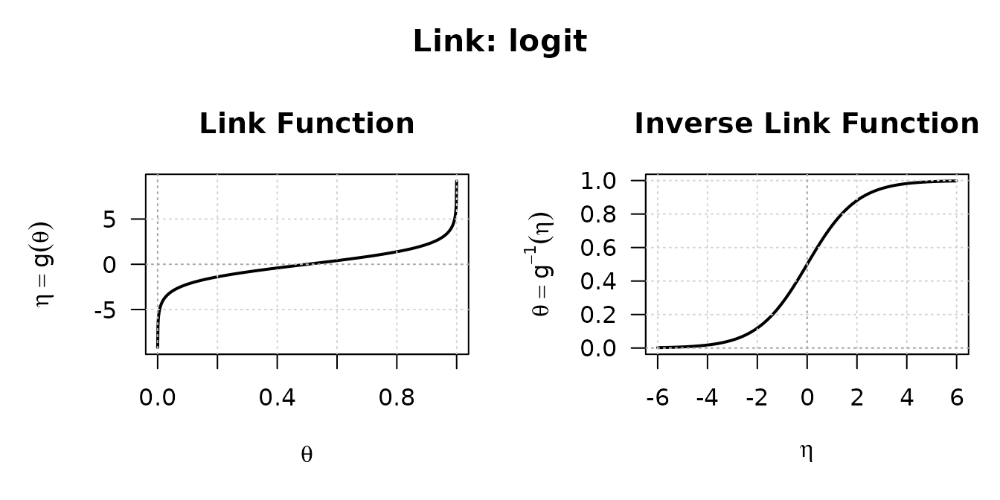
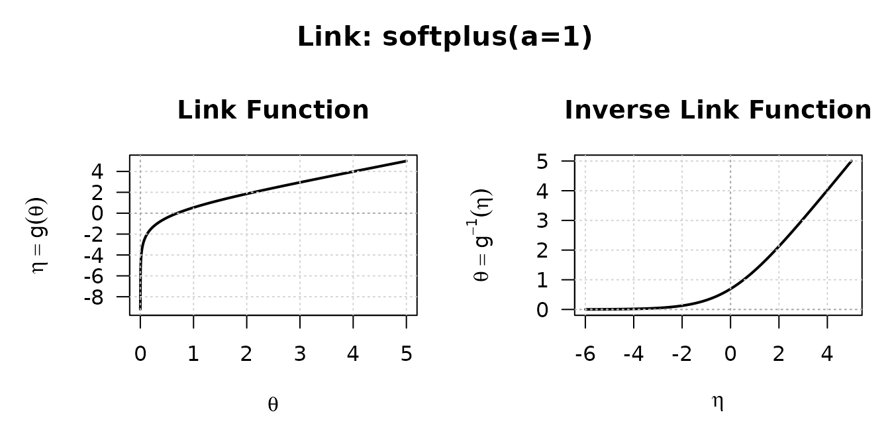

# Working with link functions

``` r

library(linkfunctions7)
```

A link function maps a constrained parameter $`\theta`$ to an
unconstrained linear predictor $`\eta`$, so that a model can be fitted
without fighting the parameter’s boundary. A variance must stay
positive, a probability must stay in $`(0, 1)`$; the log and logit links
let you optimise over the whole real line and map back.

What sets **linkfunctions7** apart from a couple of
[`log()`](https://rdrr.io/r/base/Log.html) and
[`plogis()`](https://rdrr.io/r/stats/Logistic.html) calls is that every
link carries its **exact analytical derivatives up to fourth order**, in
both directions — and a diagnostic that proves they are right. That is
what a modelling package needs: a Newton or Fisher-scoring step wants
the derivative of the inverse link, and a higher-order correction wants
the ones above it.

## A link is an object

Each link is created by a constructor and prints its name, domain, and
any parameters:

``` r

log_link()
#> S7 Link Object: log
#>   - Parameter domain (theta): (0, Inf)
logit_link()
#> S7 Link Object: logit
#>   - Parameter domain (theta): (0, 1)
```

The two directions and their derivatives are generics that dispatch on
the link:

``` r

lk <- log_link()
theta <- c(0.5, 1, 2)

linkfun(lk, theta)       # eta = g(theta) = log(theta)
#> [1] -0.6931472  0.0000000  0.6931472
linkinv(lk, linkfun(lk, theta))   # back to theta
#> [1] 0.5 1.0 2.0
```

The forward derivatives are taken with respect to $`\theta`$, the
inverse ones with respect to $`\eta`$:

``` r

eta <- linkfun(lk, theta)

dlinkfun(lk, theta)      # g'(theta)
#> [1] 2.0 1.0 0.5
dlinkinv(lk, eta)        # (g^{-1})'(eta)
#> [1] 0.5 1.0 2.0
```

They are exact, not finite differences. For the log link
$`g(\theta) = \log\theta`$ so $`g'(\theta) = 1/\theta`$, and indeed:

``` r

all.equal(dlinkfun(lk, theta), 1 / theta)
#> [1] TRUE
```

## Every order, either direction

[`linkderiv()`](https://statmodels7.github.io/linkfunctions7/reference/linkderiv.md)
and
[`linkinvderiv()`](https://statmodels7.github.io/linkfunctions7/reference/linkinvderiv.md)
reach any order from zero to four without naming a separate function:

``` r

lk <- logit_link()
theta <- c(0.2, 0.5, 0.8)
eta <- linkfun(lk, theta)

sapply(0:4, function(k) linkinvderiv(lk, eta, order = k))
#>      [,1] [,2]   [,3]    [,4]     [,5]
#> [1,]  0.2 0.16  0.096  0.0064 -0.08832
#> [2,]  0.5 0.25  0.000 -0.1250  0.00000
#> [3,]  0.8 0.16 -0.096  0.0064  0.08832
```

Order zero is the function itself; the columns are the successive
derivatives of the inverse logit at those three points.

## Seeing a link

Every link has a
[`plot()`](https://rdrr.io/r/graphics/plot.default.html) method that
draws the forward and inverse transformations over sensible ranges:

``` r

plot(logit_link())
```



The **softplus** link is a good one to look at. Like the log it keeps
$`\theta`$ positive, but instead of the log’s global exponential it
bends smoothly into a straight line for large $`\eta`$, which makes it
better behaved when the linear predictor wanders:

``` r

plot(softplus_link(a = 1))
```



## Bounded parameters

[`bounded_link()`](https://statmodels7.github.io/linkfunctions7/reference/bounded_link.md)
maps an interval to the whole real line. Give it a lower bound, an upper
bound, or both:

``` r

lk <- bounded_link(lwr = -3, upr = 2)
eta <- seq(-3, 3, length.out = 5)
theta <- linkinv(lk, eta)
theta
#> [1] -2.762871 -2.087872 -0.500000  1.087872  1.762871
```

`theta` stays inside $`[-3, 2]`$ whatever $`\eta`$ is, and the
derivatives are available here too:

``` r

dlinkfun(lk, theta)
#> [1] 4.427065 1.340964 0.800000 1.340964 4.427065
d2linkfun(lk, theta)
#> [1] -17.739913  -1.142115   0.000000   1.142115  17.739913
```

## The links on offer

| Constructor | Domain |
|:---|:---|
| [`identity_link()`](https://statmodels7.github.io/linkfunctions7/reference/identity_link.md) | $`(-\infty, \infty)`$ |
| [`log_link()`](https://statmodels7.github.io/linkfunctions7/reference/log_link.md) | $`(0, \infty)`$ |
| [`logit_link()`](https://statmodels7.github.io/linkfunctions7/reference/logit_link.md) | $`(0, 1)`$ |
| [`probit_link()`](https://statmodels7.github.io/linkfunctions7/reference/probit_link.md) | $`(0, 1)`$ |
| [`cloglog_link()`](https://statmodels7.github.io/linkfunctions7/reference/cloglog_link.md) | $`(0, 1)`$ |
| [`loglog_link()`](https://statmodels7.github.io/linkfunctions7/reference/loglog_link.md) | $`(0, 1)`$ |
| [`cauchit_link()`](https://statmodels7.github.io/linkfunctions7/reference/cauchit_link.md) | $`(0, 1)`$ |
| [`rhobit_link()`](https://statmodels7.github.io/linkfunctions7/reference/rhobit_link.md) | $`(-1, 1)`$ |
| [`sqrt_link()`](https://statmodels7.github.io/linkfunctions7/reference/sqrt_link.md) | $`(0, \infty)`$ |
| [`inverse_link()`](https://statmodels7.github.io/linkfunctions7/reference/inverse_link.md) | $`(0, \infty)`$ |
| [`inverse_sq_link()`](https://statmodels7.github.io/linkfunctions7/reference/inverse_sq_link.md) | $`(0, \infty)`$ |
| `power_link(lambda)` | $`(0, \infty)`$ |
| `softplus_link(a)` | $`(0, \infty)`$ |
| `bounded_link(lwr, upr)` | $`(\text{lwr}, \text{upr})`$ |

## Trust, but verify

Because the derivatives are hand-written, the package ships a diagnostic
that checks them.
[`check_link()`](https://statmodels7.github.io/linkfunctions7/reference/check_link.md)
confirms that the link inverts cleanly, that it is strictly monotone,
that the inverse function theorem $`g'(\theta)\,(g^{-1})'(\eta) = 1`$
holds, and that every analytical derivative matches a numerical one:

``` r

invisible(check_link(logit_link()))
#> Checking S7 Link Object: logit 
#>   [1] Invertibility (Theta space): [PASSED] 
#>   [2] Invertibility (Eta space):   [PASSED] 
#>   [3] Strict Monotonicity:         [PASSED] 
#>   [4] Inverse Function Theorem:    [PASSED] 
#>   [5] Link Derivatives:            [PASSED] 
#>   [6] Inverse Link Derivatives:    [PASSED]
```

Run it on any link before you rely on it — and certainly on any link you
write yourself.

## Defining your own link

A new link is a subclass of `link` with its ten methods: the two
directions and their four derivatives each. The pattern is short; here
is a complete one for the **negative log-log** link,
$`\eta = -\log(-\log\theta)`$ on $`(0, 1)`$.

``` r

NegLogLog <- S7::new_class("NegLogLog", parent = link)

S7::method(linkfun, NegLogLog)  <- function(x, theta) -log(-log(theta))
S7::method(linkinv, NegLogLog)  <- function(x, eta)   exp(-exp(-eta))

S7::method(dlinkfun,  NegLogLog) <- function(x, theta) -1 / (theta * log(theta))
S7::method(d2linkfun, NegLogLog) <- function(x, theta) (1 + log(theta)) / (theta * log(theta))^2
S7::method(d3linkfun, NegLogLog) <- function(x, theta) {
  l <- log(theta)
  -(2 * l^2 + 3 * l + 2) / (theta * l)^3
}
S7::method(d4linkfun, NegLogLog) <- function(x, theta) {
  l <- log(theta)
  (6 * l^3 + 11 * l^2 + 12 * l + 6) / (theta * l)^4
}

S7::method(dlinkinv,  NegLogLog) <- function(x, eta) exp(-eta - exp(-eta))
S7::method(d2linkinv, NegLogLog) <- function(x, eta) exp(-eta - exp(-eta)) * (exp(-eta) - 1)
S7::method(d3linkinv, NegLogLog) <- function(x, eta) {
  e <- exp(-eta)
  exp(-eta - e) * (e^2 - 3 * e + 1)
}
S7::method(d4linkinv, NegLogLog) <- function(x, eta) {
  e <- exp(-eta)
  exp(-eta - e) * (e^3 - 6 * e^2 + 7 * e - 1)
}

neglog <- NegLogLog(link_name = "neglog-log", link_bounds = c(0, 1), link_params = NULL)
```

Did the derivatives come out right? Ask the diagnostic rather than
trusting the algebra:

``` r

invisible(check_link(neglog))
#> Checking S7 Link Object: neglog-log 
#>   [1] Invertibility (Theta space): [PASSED] 
#>   [2] Invertibility (Eta space):   [PASSED] 
#>   [3] Strict Monotonicity:         [PASSED] 
#>   [4] Inverse Function Theorem:    [PASSED] 
#>   [5] Link Derivatives:            [PASSED] 
#>   [6] Inverse Link Derivatives:    [PASSED]
```

If any line came back `[FAILED]`, that is a derivative to revisit —
which is exactly the mistake
[`check_link()`](https://statmodels7.github.io/linkfunctions7/reference/check_link.md)
exists to catch.

## Where to go next

- [`?check_link`](https://statmodels7.github.io/linkfunctions7/reference/check_link.md)
  — the full diagnostic and what each check means.
- [`?linkinvderiv`](https://statmodels7.github.io/linkfunctions7/reference/linkinvderiv.md)
  — reaching any derivative order.
- The [distributions7](https://github.com/statmodels7/distributions7)
  package, where these links become the scale on which distributions are
  fitted.
