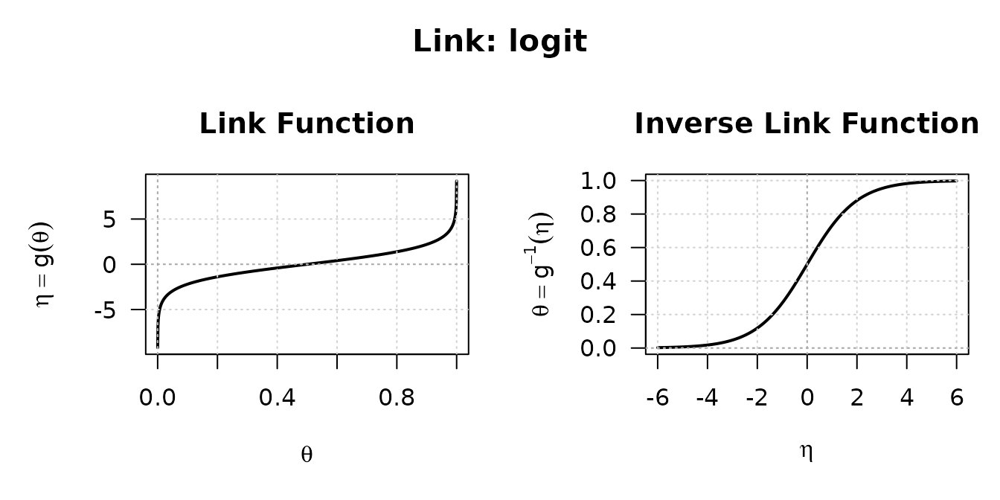
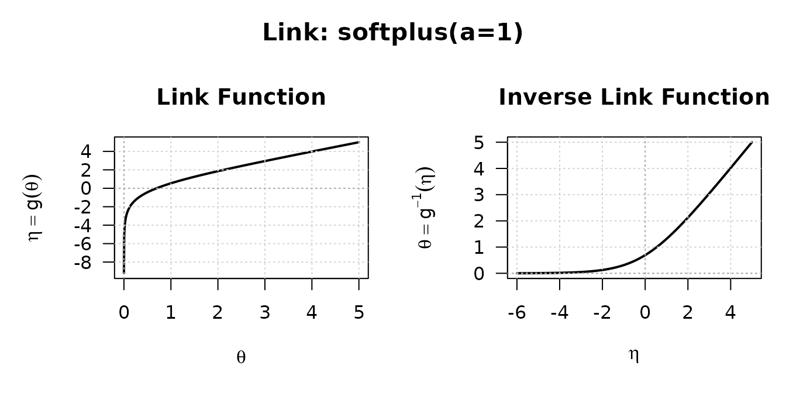

# Working with link functions

``` r

library(linkfunctions7)
```

A link function maps a constrained parameter $`\theta`$ to an
unconstrained linear predictor $`\eta`$, so that a model can be fitted
without fighting the parameter’s boundary. A variance must stay positive
and a probability must stay in $`(0, 1)`$; the log and logit links move
the optimization onto the whole real line and map the result back.

Unlike a pair of [`log()`](https://rdrr.io/r/base/Log.html) and
[`plogis()`](https://rdrr.io/r/stats/Logistic.html) calls, every link in
**linkfunctions7** carries its **exact analytical derivatives up to
fifth order**, in both directions, together with a diagnostic that
verifies them. A modeling package needs these derivatives: a Newton or
Fisher-scoring step uses the derivative of the inverse link, and a
higher-order correction uses the orders above it. The fifth order is
needed by models whose predictor is defined by a recursion, since each
order of differentiation through the recursion involves one more order
of the link.

## A link is an object

Each link is created by a constructor and prints its name, domain, and
any parameters:

``` r

log_link()
#> S7 Link Object: log
#>   - Parameter domain (theta): (0, Inf)
logit_link()
#> S7 Link Object: logit
#>   - Parameter domain (theta): (0, 1)
```

The two directions and their derivatives are generics that dispatch on
the link:

``` r

lk <- log_link()
theta <- c(0.5, 1, 2)

linkfun(lk, theta)       # eta = g(theta) = log(theta)
#> [1] -0.6931472  0.0000000  0.6931472
linkinv(lk, linkfun(lk, theta))   # back to theta
#> [1] 0.5 1.0 2.0
```

The forward derivatives are taken with respect to $`\theta`$, the
inverse ones with respect to $`\eta`$:

``` r

eta <- linkfun(lk, theta)

dlinkfun(lk, theta)      # g'(theta)
#> [1] 2.0 1.0 0.5
dlinkinv(lk, eta)        # (g^{-1})'(eta)
#> [1] 0.5 1.0 2.0
```

These derivatives are closed-form expressions, not finite differences.
For the log link, $`g(\theta) = \log\theta`$ and
$`g'(\theta) = 1/\theta`$:

``` r

all.equal(dlinkfun(lk, theta), 1 / theta)
#> [1] TRUE
```

## Every order, either direction

[`linkderiv()`](https://statmodels7.github.io/linkfunctions7/reference/linkderiv.md)
and
[`linkinvderiv()`](https://statmodels7.github.io/linkfunctions7/reference/linkinvderiv.md)
reach any order from zero to five without naming a separate function:

``` r

lk <- logit_link()
theta <- c(0.2, 0.5, 0.8)
eta <- linkfun(lk, theta)

sapply(0:5, function(k) linkinvderiv(lk, eta, order = k))
#>      [,1] [,2]   [,3]    [,4]     [,5]     [,6]
#> [1,]  0.2 0.16  0.096  0.0064 -0.08832 -0.11648
#> [2,]  0.5 0.25  0.000 -0.1250  0.00000  0.25000
#> [3,]  0.8 0.16 -0.096  0.0064  0.08832 -0.11648
```

Order zero is the function itself; the columns are the successive
derivatives of the inverse logit at those three points.

The fifth forward derivative of the exponential links has a limited
range. These links floor $`\theta = e^{\eta}`$ at a value chosen so that
the fourth forward derivative $`-6/\theta^4`$ stays representable with a
factor of four to spare, and at that value the fifth, $`24/\theta^5`$,
is not. The forward fifth derivative of a log, lower- or upper-bounded
link is therefore `Inf` below about $`\eta = -141`$, while the fourth
remains finite to $`\eta = -200`$. Raising the floor to cover the fifth
would clamp $`\theta`$ over a range where
[`linkinv()`](https://statmodels7.github.io/linkfunctions7/reference/linkinv.md)
is now exact, so the floor is left where it is. In the lower tail the
inverse direction, which a chain rule onto the link scale uses, is
finite at every order.

## Seeing a link

Every link has a
[`plot()`](https://rdrr.io/r/graphics/plot.default.html) method that
draws the forward and inverse transformations over sensible ranges:

``` r

plot(logit_link())
```



The **softplus** link illustrates the differences between positivity
links. Like the log it keeps $`\theta`$ positive, but for large $`\eta`$
it grows linearly instead of exponentially, so a large linear predictor
does not produce an extremely large parameter:

``` r

plot(softplus_link(a = 1))
```



## Bounded parameters

[`bounded_link()`](https://statmodels7.github.io/linkfunctions7/reference/bounded_link.md)
maps an interval to the whole real line. Give it a lower bound, an upper
bound, or both:

``` r

lk <- bounded_link(lwr = -3, upr = 2)
eta <- seq(-3, 3, length.out = 5)
theta <- linkinv(lk, eta)
theta
#> [1] -2.762871 -2.087872 -0.500000  1.087872  1.762871
```

`theta` stays inside $`[-3, 2]`$ whatever $`\eta`$ is, and the
derivatives are available here too:

``` r

dlinkfun(lk, theta)
#> [1] 4.427065 1.340964 0.800000 1.340964 4.427065
d2linkfun(lk, theta)
#> [1] -17.739913  -1.142115   0.000000   1.142115  17.739913
```

## The available links

| Constructor | Domain |
|:---|:---|
| [`identity_link()`](https://statmodels7.github.io/linkfunctions7/reference/identity_link.md) | $`(-\infty, \infty)`$ |
| [`log_link()`](https://statmodels7.github.io/linkfunctions7/reference/log_link.md) | $`(0, \infty)`$ |
| [`logit_link()`](https://statmodels7.github.io/linkfunctions7/reference/logit_link.md) | $`(0, 1)`$ |
| [`probit_link()`](https://statmodels7.github.io/linkfunctions7/reference/probit_link.md) | $`(0, 1)`$ |
| [`cloglog_link()`](https://statmodels7.github.io/linkfunctions7/reference/cloglog_link.md) | $`(0, 1)`$ |
| [`loglog_link()`](https://statmodels7.github.io/linkfunctions7/reference/loglog_link.md) | $`(0, 1)`$ |
| [`cauchit_link()`](https://statmodels7.github.io/linkfunctions7/reference/cauchit_link.md) | $`(0, 1)`$ |
| [`rhobit_link()`](https://statmodels7.github.io/linkfunctions7/reference/rhobit_link.md) | $`(-1, 1)`$ |
| [`sqrt_link()`](https://statmodels7.github.io/linkfunctions7/reference/sqrt_link.md) | $`(0, \infty)`$ |
| [`inverse_link()`](https://statmodels7.github.io/linkfunctions7/reference/inverse_link.md) | $`(0, \infty)`$ |
| [`inverse_sq_link()`](https://statmodels7.github.io/linkfunctions7/reference/inverse_sq_link.md) | $`(0, \infty)`$ |
| `power_link(lambda)` | $`(0, \infty)`$ |
| `softplus_link(a)` | $`(0, \infty)`$ |
| `bounded_link(lwr, upr)` | $`(\text{lwr}, \text{upr})`$ |

## Validating a link

Because the derivatives are hand-written, the package ships a diagnostic
that checks them.
[`check_link()`](https://statmodels7.github.io/linkfunctions7/reference/check_link.md)
confirms that the link inverts cleanly, that it is strictly monotone,
that the inverse function theorem $`g'(\theta)\,(g^{-1})'(\eta) = 1`$
holds, and that every analytical derivative matches a numerical one:

``` r

invisible(check_link(logit_link()))
#> Checking S7 Link Object: logit 
#>   [1] Invertibility (Theta space): [PASSED] 
#>   [2] Invertibility (Eta space):   [PASSED] 
#>   [3] Strict Monotonicity:         [PASSED] 
#>   [4] Inverse Function Theorem:    [PASSED] 
#>   [5] Link Derivatives:            [PASSED] 
#>   [6] Inverse Link Derivatives:    [PASSED]
```

The diagnostic accepts any link and is most useful for a newly written
one.

## Defining a new link

A new link is a subclass of `link` with methods for the two directions
and their five derivatives each, twelve methods in all. Only
[`linkfun()`](https://statmodels7.github.io/linkfunctions7/reference/linkfun.md)
and
[`linkinv()`](https://statmodels7.github.io/linkfunctions7/reference/linkinv.md)
are compulsory: the base class supplies every derivative that a link
does not implement, by one stencil applied to the highest order that the
link does implement. The example below writes four orders in each
direction and leaves the fifth to that fallback. It is the **negative
log-log** link, $`\eta = -\log(-\log\theta)`$ on $`(0, 1)`$.

``` r

NegLogLog <- S7::new_class("NegLogLog", parent = link)

S7::method(linkfun, NegLogLog)  <- function(x, theta) -log(-log(theta))
S7::method(linkinv, NegLogLog)  <- function(x, eta)   exp(-exp(-eta))

S7::method(dlinkfun,  NegLogLog) <- function(x, theta) -1 / (theta * log(theta))
S7::method(d2linkfun, NegLogLog) <- function(x, theta) (1 + log(theta)) / (theta * log(theta))^2
S7::method(d3linkfun, NegLogLog) <- function(x, theta) {
  l <- log(theta)
  -(2 * l^2 + 3 * l + 2) / (theta * l)^3
}
S7::method(d4linkfun, NegLogLog) <- function(x, theta) {
  l <- log(theta)
  (6 * l^3 + 11 * l^2 + 12 * l + 6) / (theta * l)^4
}

S7::method(dlinkinv,  NegLogLog) <- function(x, eta) exp(-eta - exp(-eta))
S7::method(d2linkinv, NegLogLog) <- function(x, eta) exp(-eta - exp(-eta)) * (exp(-eta) - 1)
S7::method(d3linkinv, NegLogLog) <- function(x, eta) {
  e <- exp(-eta)
  exp(-eta - e) * (e^2 - 3 * e + 1)
}
S7::method(d4linkinv, NegLogLog) <- function(x, eta) {
  e <- exp(-eta)
  exp(-eta - e) * (e^3 - 6 * e^2 + 7 * e - 1)
}

neglog <- NegLogLog(link_name = "neglog-log", link_bounds = c(0, 1), link_params = NULL)
```

The diagnostic verifies the hand-written derivatives:

``` r

invisible(check_link(neglog))
#> Checking S7 Link Object: neglog-log 
#>   [1] Invertibility (Theta space): [PASSED] 
#>   [2] Invertibility (Eta space):   [PASSED] 
#>   [3] Strict Monotonicity:         [PASSED] 
#>   [4] Inverse Function Theorem:    [PASSED] 
#>   [5] Link Derivatives:            [PASSED to order 4, 1 numerical] 
#>   [6] Inverse Link Derivatives:    [PASSED to order 4, 1 numerical]
```

Both derivative rows report that they passed to order four, with one
order numerical. The fifth order comes from the fallback and is not
checked, since it would be compared with a numerical differentiation of
the order below it; the two would be the same computation and would
agree even for a wrong link.
[`link_fallback_orders()`](https://statmodels7.github.io/linkfunctions7/reference/link_fallback_orders.md)
returns the same information as a list.

A line reporting `[FAILED]` marks a derivative that disagrees with its
numerical reference.

## Further reading

- [`?check_link`](https://statmodels7.github.io/linkfunctions7/reference/check_link.md):
  the full diagnostic and the meaning of each check.
- [`?linkinvderiv`](https://statmodels7.github.io/linkfunctions7/reference/linkinvderiv.md):
  derivatives of any order.
- The [distributions7](https://github.com/statmodels7/distributions7)
  package, where these links become the scale on which distributions are
  fitted.
